# 🧠 Lanonasis Ecosystem Relationship Graph

## Overview

This document provides a comprehensive relationship graph of the entire Lanonasis ecosystem, showing how different components interact, data flows, authentication paths, and service dependencies. This serves as the master reference for understanding the complete architecture.

## 🏗️ **High-Level Architecture**

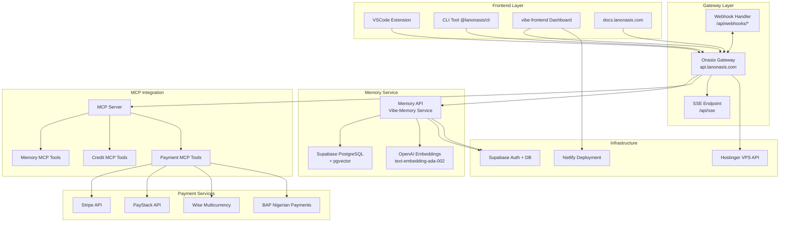

## 🔐 **Authentication Flow**

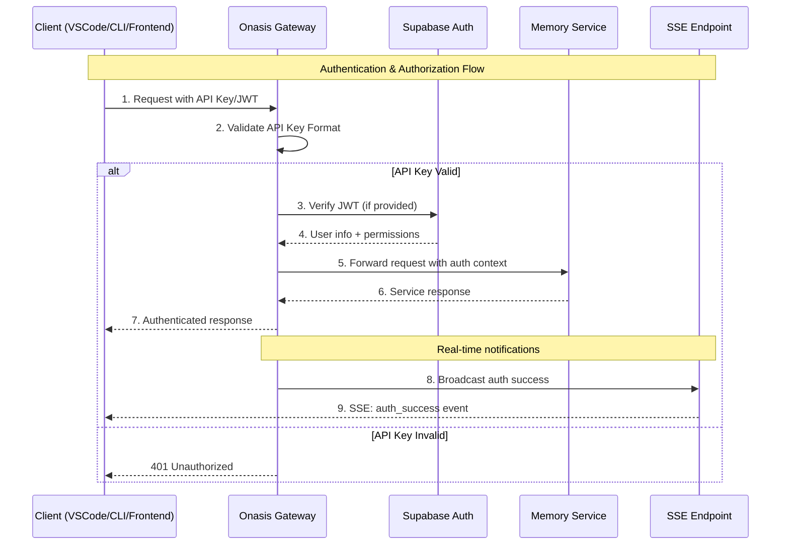

## 📊 **Data Flow Architecture**

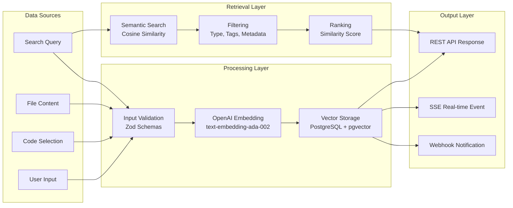

## 🚀 **Service Integration Map**

```mermaid
graph TB
    subgraph "Lanonasis Core Services"
        Memory[Memory as a Service<br/>📝 Vector Memory Management]
        Credit[Credit as a Service<br/>💳 Credit Processing Platform]
        Gateway[Onasis Gateway<br/>🌐 API Service Warehouse]
    end
    
    subgraph "18+ Integrated APIs"
        Payment1[Stripe API<br/>💰 Payment Processing]
        Payment2[PayStack API<br/>🏦 African Payments]
        Payment3[Wise MCA<br/>💱 Multi-currency]
        Payment4[BAP API<br/>🇳🇬 Nigerian Payments]
        
        Infra1[Hostinger API<br/>🖥️ VPS Management]
        Infra2[Google Analytics<br/>📊 Analytics]
        Infra3[Shutterstock API<br/>🖼️ Images]
        
        Dev1[GitHub API<br/>⚡ Repository Management]
        Dev2[NGrok API<br/>🔗 Tunneling]
        Dev3[API Testing<br/>🧪 Testing Tools]
        
        Other[... 9 more services<br/>📦 Business APIs]
    end
    
    subgraph "Development Tools"
        VSCode2[VSCode Extension<br/>🔧 IDE Integration]
        CLI2[CLI Tool<br/>⌨️ Command Line]
        SDK[TypeScript SDK<br/>📚 @lanonasis/memory-client]
    end
    
    subgraph "Frontend Interfaces"
        Dashboard[vibe-frontend<br/>🎨 Next.js Dashboard]
        Docs2[Documentation<br/>📖 docs.lanonasis.com]
        API_Explorer[API Explorer<br/>🔍 Interactive Testing]
    end
    
    %% Core service connections
    Gateway <--> Memory
    Gateway <--> Credit
    
    %% API integrations
    Gateway <--> Payment1
    Gateway <--> Payment2
    Gateway <--> Payment3
    Gateway <--> Payment4
    Gateway <--> Infra1
    Gateway <--> Infra2
    Gateway <--> Infra3
    Gateway <--> Dev1
    Gateway <--> Dev2
    Gateway <--> Dev3
    Gateway <--> Other
    
    %% Development tools
    VSCode2 <--> Gateway
    CLI2 <--> Gateway
    SDK <--> Gateway
    
    %% Frontend interfaces
    Dashboard <--> Gateway
    Docs2 <--> Gateway
    API_Explorer <--> Gateway
```

## 🔄 **Memory Service Lifecycle**

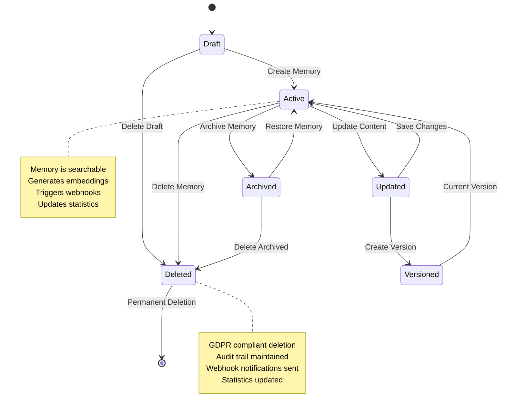

## 📡 **Real-time Communication Flow**

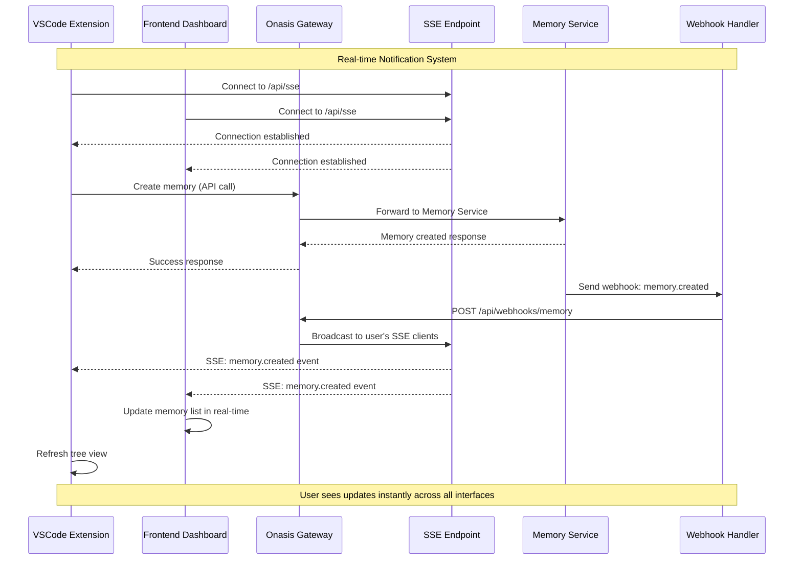

## 🛡️ **Security & Compliance Architecture**

```mermaid
graph TB
    subgraph "Authentication Layer"
        APIKey[API Key Validation<br/>onasis_[base64]]
        JWT[JWT Token Validation<br/>Supabase Auth]
        HMAC[HMAC Signature<br/>Financial Operations]
    end
    
    subgraph "Authorization Layer"
        RLS[Row Level Security<br/>PostgreSQL RLS Policies]
        RBAC[Role-Based Access<br/>Admin/User/Viewer]
        Plans[Plan-Based Features<br/>Free/Pro/Enterprise]
    end
    
    subgraph "Data Protection"
        Encrypt[Encryption at Rest<br/>AES-256 via Supabase]
        TLS[TLS 1.3 in Transit<br/>Perfect Forward Secrecy]
        PII[PII Detection & Masking<br/>Automatic Privacy Protection]
    end
    
    subgraph "Compliance Frameworks"
        GDPR[GDPR Compliance<br/>EU Data Protection]
        HIPAA[HIPAA Framework<br/>Healthcare Data]
        SOC2[SOC 2 Type II<br/>Security Controls]
        ISO[ISO 27001/27002<br/>Security Management]
    end
    
    subgraph "Monitoring & Auditing"
        Logs[Structured Logging<br/>Winston + JSON Format]
        Metrics[Prometheus Metrics<br/>Performance & Usage]
        Audit[Audit Trails<br/>Immutable Event Logs]
        SIEM[SIEM Integration<br/>Splunk/ELK Compatible]
    end
    
    %% Security flow
    APIKey --> RLS
    JWT --> RBAC
    HMAC --> Plans
    
    RLS --> Encrypt
    RBAC --> TLS
    Plans --> PII
    
    Encrypt --> GDPR
    TLS --> HIPAA
    PII --> SOC2
    
    GDPR --> Logs
    HIPAA --> Metrics
    SOC2 --> Audit
    ISO --> SIEM
```

## 💾 **Database Schema Relationships**

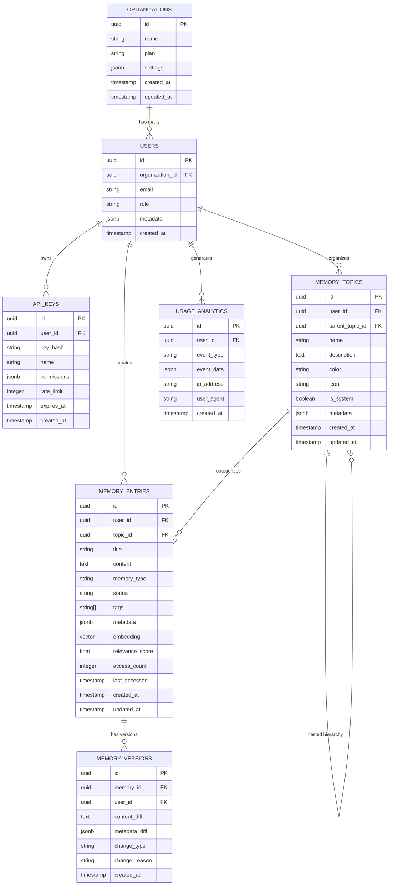

## 🔧 **MCP Tool Integration**

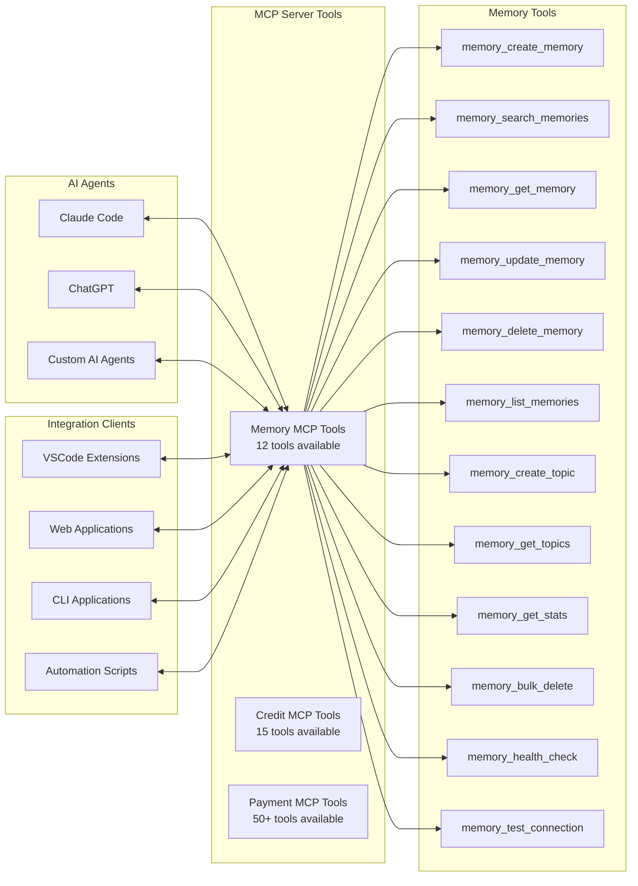

## 🌐 **Deployment Architecture**

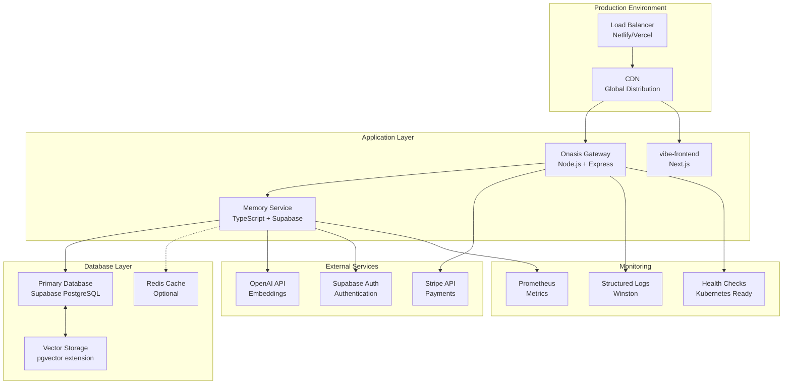

## 📈 **Analytics & Monitoring Flow**

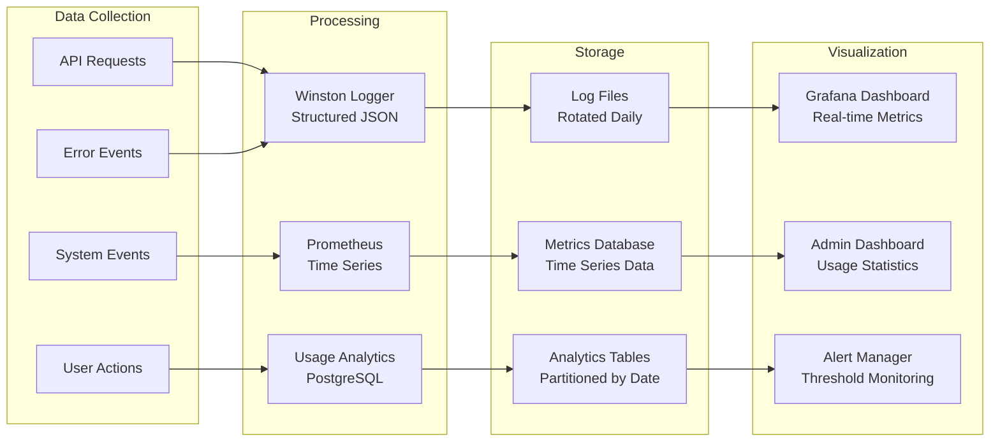

## 🔗 **API Endpoint Mapping**

### Memory Service Endpoints
```
Base URL: https://api.lanonasis.com/api/v1

Authentication: X-API-Key: onasis_[base64] | Authorization: Bearer [jwt]

Memory Management:
├── POST   /memory                    → Create memory
├── GET    /memory                    → List memories (paginated)
├── POST   /memory/search             → Semantic search
├── GET    /memory/{id}               → Get specific memory
├── PUT    /memory/{id}               → Update memory
├── DELETE /memory/{id}               → Delete memory
├── POST   /memory/bulk/delete        → Bulk delete (Pro/Enterprise)
└── GET    /memory/stats              → Memory statistics

Topic Management:
├── POST   /topics                    → Create topic
├── GET    /topics                    → List topics
├── GET    /topics/{id}               → Get topic
├── PUT    /topics/{id}               → Update topic
└── DELETE /topics/{id}               → Delete topic

System:
├── GET    /health                    → Health check
└── GET    /user/data-export          → GDPR data export
```

### Onasis Gateway Endpoints
```
Base URL: https://api.lanonasis.com

Gateway Services:
├── GET    /health                    → Gateway health
├── GET    /api/adapters              → List all service adapters
├── GET    /api/tools                 → List all available tools
├── POST   /api/adapters/{service}/tools/{tool} → Execute tool
├── GET    /api/sse                   → Server-Sent Events
├── POST   /api/sse/auth              → SSE authentication
└── POST   /api/webhooks/memory       → Memory service webhooks

Credit as a Service:
├── POST   /api/credit/applications   → Submit credit application
├── GET    /api/credit/applications   → List applications
├── GET    /api/credit/providers      → List credit providers
└── POST   /api/credit/transactions   → Process transactions

Payment Services:
├── POST   /api/payments/stripe       → Stripe integration
├── POST   /api/payments/paystack     → PayStack integration
├── POST   /api/payments/wise         → Wise integration
└── POST   /api/payments/bap          → BAP integration
```

## 🎯 **Future Integration Points**

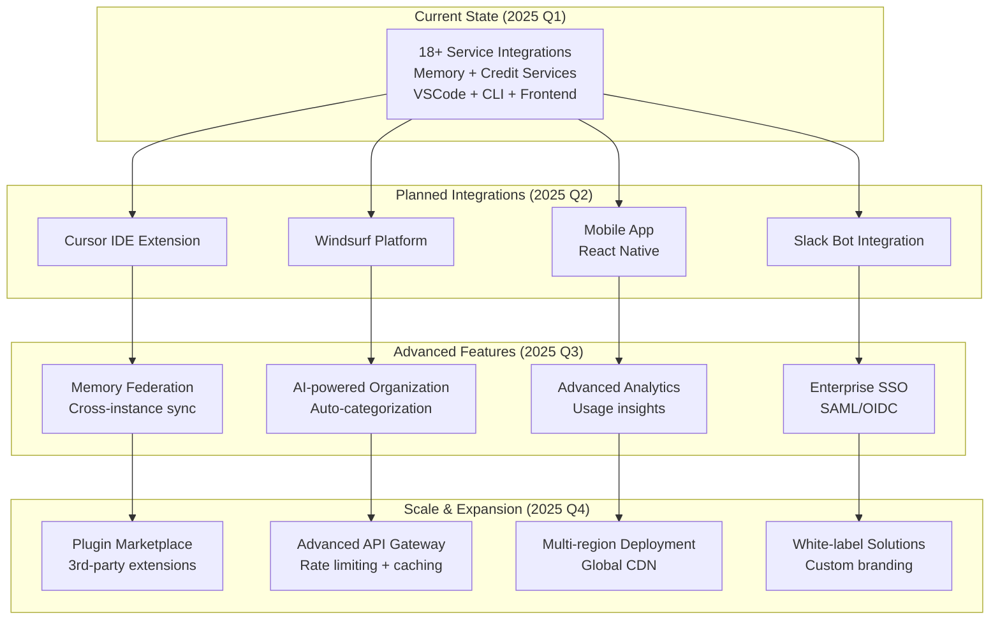

## 📋 **Integration Checklist**

### ✅ Completed Integrations
- **Memory as a Service**: Full vector memory platform
- **VSCode Extension**: IDE integration with tree view, search, create
- **CLI Tool**: Command-line interface (@lanonasis/cli)
- **TypeScript SDK**: Client library (@lanonasis/memory-client)
- **Onasis Gateway**: 18+ API service integrations
- **MCP Server**: AI agent tool integration
- **SSE Support**: Real-time notifications
- **vibe-frontend**: Next.js dashboard
- **Authentication**: JWT + API key system
- **Compliance**: GDPR, HIPAA, SOC 2 frameworks

### 🔄 In Progress
- **Extended Gateway Integration**: Memory service adapter
- **Real-time Dashboard**: SSE-powered live updates
- **Comprehensive Testing**: Integration and E2E tests
- **Documentation**: API documentation site

### ⏳ Planned
- **Cursor IDE**: Extension porting
- **Windsurf Platform**: Integration development
- **Mobile App**: React Native implementation
- **Advanced Analytics**: Usage insights and reporting
- **Plugin Marketplace**: 3rd-party extension ecosystem

---

## 🔧 **Development Reference**

### Key File Locations
```
Lanonasis Ecosystem Structure:
├── vibe-memory/                          # Core Memory Service
│   ├── src/                             # TypeScript source
│   ├── vscode-extension/                # VSCode integration
│   ├── cli/                             # CLI tool
│   └── sdk/                             # TypeScript SDK
├── vibe-frontend/                        # Next.js Dashboard
│   ├── app/                             # App router pages
│   ├── components/                      # UI components
│   └── lib/                             # Utilities
├── onasis-gateway/                       # API Service Warehouse
│   ├── services/                        # Service adapters
│   ├── mcp-server/                      # MCP integration
│   ├── core/                            # Shared utilities
│   └── scripts/                         # Management tools
└── docs/                                # Documentation
    ├── api/                             # API documentation
    ├── guides/                          # User guides
    └── architecture/                    # System design
```

### Environment Variables
```bash
# Memory Service
MEMORY_API_URL=https://api.lanonasis.com
MEMORY_API_KEY=onasis_[your_key]
SUPABASE_URL=https://[project].supabase.co
SUPABASE_KEY=[anon_key]
OPENAI_API_KEY=[openai_key]

# Onasis Gateway
PORT=3001
CORS_ORIGIN=*
MEMORY_WEBHOOK_SECRET=[webhook_secret]

# Authentication
JWT_SECRET=[jwt_secret]
SUPABASE_SERVICE_KEY=[service_key]

# Optional
REDIS_URL=[redis_connection]
LOG_LEVEL=info
ENABLE_METRICS=true
```

This comprehensive relationship graph serves as the master reference for understanding how all components of the Lanonasis ecosystem interact, providing clear guidance for future development and integration efforts.