# 🚀 Lanonasis MaaS Integration Roadmap
## Onasis Gateway → Lanonasis-MaaS Migration & Scaling Plan

## Overview

This document outlines the comprehensive plan to migrate and scale the Onasis Gateway services to leverage the **lanonasis-maas** (Multi-tenant Architecture as a Service) infrastructure for enterprise-grade service delivery.

## Current State Analysis

### 🏗️ **Service Architecture Tiers**

```mermaid
graph TB
    subgraph "Tier 1: Core Lanonasis Services (Ready)"
        Memory[Memory-as-a-Service<br/>✅ Full Integration]
        Credit[Credit-as-a-Service<br/>✅ Full Integration]
        XWallet[Xpress Wallet WaaS<br/>✅ Service Provider Mode]
    end
    
    subgraph "Tier 2: Enhanced Payment Services"
        Flutter[Flutterwave Gateway<br/>🆕 Enhanced]
        Paystack[PayStack<br/>🔧 Basic → Enhanced]
        Stripe[Stripe<br/>🔧 Basic → Enhanced]
        Wise[Wise MCA<br/>🔧 Basic → Enhanced]
        BAP[BAP Payment<br/>🔧 Basic → Enhanced]
        SaySwitch[SaySwitch<br/>🔧 Basic → Enhanced]
    end
    
    subgraph "Tier 3: Infrastructure Services"
        Hostinger[Hostinger API<br/>🔧 Basic Client]
        Analytics[Google Analytics<br/>🔧 Basic Client]
        Shutterstock[Shutterstock<br/>🔧 Basic Client]
    end
    
    subgraph "Tier 4: Development Tools"
        NGrok[NGrok API<br/>🔧 Basic Client]
        Testing[API Testing<br/>🔧 Basic Client]
        Business[Business APIs<br/>🔧 Basic Clients]
    end
```



## Phase 1: Foundation Setup (Weeks 1-2)

### 1.1 Lanonasis-MaaS Infrastructure Preparation

```bash
# Repository structure alignment
lanonasis-maas/
├── core/
│   ├── service-registry/           # Central service discovery
│   ├── client-management/          # Multi-tenant client handling
│   ├── authentication/             # Unified auth system
│   └── billing/                    # Usage-based billing
├── services/
│   ├── memory-service/             # Migrate from onasis-gateway
│   ├── credit-service/             # Migrate from onasis-gateway
│   ├── payment-services/           # Consolidated payment hub
│   └── infrastructure-services/    # Supporting services
├── interfaces/
│   ├── mcp-server/                 # Model Context Protocol
│   ├── rest-api/                   # Traditional REST endpoints
│   ├── graphql-api/                # GraphQL interface
│   └── websocket-api/              # Real-time connections
├── clients/
│   ├── typescript-sdk/             # @lanonasis/maas-client
│   ├── cli-tools/                  # @lanonasis/maas-cli
│   ├── vscode-extension/           # IDE integration
│   └── web-dashboard/              # Management interface
└── deployment/
    ├── docker/                     # Container configurations
    ├── kubernetes/                 # K8s manifests
    ├── terraform/                  # Infrastructure as Code
    └── ci-cd/                      # Deployment pipelines
```

### 1.2 Service Provider Architecture Template

```typescript
// services/base-service-provider/service-provider-template.ts
export abstract class ServiceProviderTemplate {
  // Multi-tenant isolation
  abstract setupClientIsolation(): Promise<void>;
  
  // Service-specific implementations
  abstract initializeService(config: ServiceConfig): Promise<void>;
  
  // Third-party client extensions
  abstract enableThirdPartyAccess(): Promise<void>;
  
  // Standardized interfaces
  getMCPTools(): MCPTool[];
  getRESTEndpoints(): RESTEndpoint[];
  getSDKMethods(): SDKMethod[];
  getCLICommands(): CLICommand[];
}
```

## Phase 2: Service Migration Strategy (Weeks 3-8)

### 2.1 **Tier 1 Services Migration** (Week 3-4)

#### Memory-as-a-Service Migration
```yaml
# deployment/services/memory-service.yaml
apiVersion: v1
kind: ConfigMap
metadata:
  name: memory-service-config
data:
  service_type: "core_lanonasis"
  integration_level: "full"
  interfaces:
    - mcp
    - rest_api
    - sdk
    - cli
  client_isolation: "rls_enabled"
  billing_model: "usage_based"
```

**Migration Steps:**
1. Extract from `onasis-gateway/services/memory-as-a-service/`
2. Enhance with multi-tenant architecture
3. Add client billing integration
4. Implement service discovery registration
5. Deploy to lanonasis-maas infrastructure

#### Credit-as-a-Service Migration
```typescript
// services/credit-service/credit-maas-service.ts
export class CreditMaaSService extends ServiceProviderTemplate {
  async setupClientIsolation() {
    // Implement RLS for credit applications
    await this.db.enableRowLevelSecurity('credit_applications');
    await this.db.enableRowLevelSecurity('credit_providers');
  }
  
  async enableThirdPartyAccess() {
    // Allow fintech partners to offer credit through API
    return this.createClientAPIEndpoints([
      '/api/v1/client/:clientId/credit/apply',
      '/api/v1/client/:clientId/credit/status',
      '/api/v1/client/:clientId/credit/providers'
    ]);
  }
}
```

### 2.2 **Tier 2 Payment Services Enhancement** (Week 5-6)

#### Flutterwave Enhancement (Template for Others)
```typescript
// services/payment-services/flutterwave-maas/flutterwave-service-provider.ts
export class FlutterwaveMaaSService extends ServiceProviderTemplate {
  async setupClientIsolation() {
    // Create isolated Flutterwave configurations per client
    await this.createClientConfigurations();
    await this.setupTransactionIsolation();
  }
  
  getMCPTools(): MCPTool[] {
    return [
      {
        name: 'flutterwave_process_payment',
        description: 'Process payment via Flutterwave',
        inputSchema: { /* ... */ }
      },
      {
        name: 'flutterwave_create_virtual_card',
        description: 'Create virtual card for client',
        inputSchema: { /* ... */ }
      }
    ];
  }
  
  getCLICommands(): CLICommand[] {
    return [
      {
        command: 'payment process --provider flutterwave --amount 1000',
        description: 'Process payment via CLI'
      },
      {
        command: 'wallet create --provider flutterwave --customer-email user@example.com',
        description: 'Create wallet via CLI'
      }
    ];
  }
}
```

#### Payment Services Consolidation Strategy
```typescript
// services/payment-services/payment-hub.ts
export class PaymentHubService {
  private providers = new Map<string, PaymentProvider>();
  
  constructor() {
    // Register all payment providers
    this.registerProvider('flutterwave', new FlutterwaveMaaSService());
    this.registerProvider('paystack', new PaystackMaaSService());
    this.registerProvider('stripe', new StripeMaaSService());
    this.registerProvider('wise', new WiseMaaSService());
    this.registerProvider('bap', new BAPMaaSService());
    this.registerProvider('sayswitch', new SaySwitchMaaSService());
  }
  
  async processPayment(provider: string, clientId: string, paymentData: PaymentData) {
    const service = this.providers.get(provider);
    return await service.processPayment(clientId, paymentData);
  }
}
```

## Phase 3: Interface Development (Weeks 7-10)

### 3.1 **MCP Server Enhancement**

```typescript
// interfaces/mcp-server/maas-mcp-server.ts
export class MaaSMCPServer {
  private services = new ServiceRegistry();
  
  async initialize() {
    // Auto-discover and register all services
    await this.services.discoverServices();
    
    // Generate MCP tools dynamically
    this.tools = await this.generateMCPTools();
  }
  
  private async generateMCPTools(): Promise<MCPTool[]> {
    const tools: MCPTool[] = [];
    
    for (const service of this.services.getAllServices()) {
      const serviceTools = await service.getMCPTools();
      tools.push(...serviceTools.map(tool => ({
        ...tool,
        name: `${service.name}_${tool.name}`,
        service_provider: service.name
      })));
    }
    
    return tools;
  }
}
```

### 3.2 **CLI Tool Development**

```bash
# CLI Command Structure
@lanonasis/maas-cli commands:

# Service management
maas service list                              # List all available services
maas service status memory-service            # Check service status
maas service deploy credit-service            # Deploy service

# Client management  
maas client create --name "Acme Corp"         # Create new client
maas client config --client acme-corp         # Switch client context
maas client billing --client acme-corp        # View billing information

# Payment operations
maas payment process --provider flutterwave --amount 1000
maas payment status --transaction tx-12345
maas wallet create --provider xpress-wallet --customer user@example.com

# Memory operations  
maas memory create --title "API Documentation" --content "..."
maas memory search --query "authentication methods"
maas memory sync --source ./docs/

# Credit operations
maas credit apply --amount 50000 --purpose "business expansion"
maas credit status --application app-12345
maas credit providers --country NG
```

### 3.3 **TypeScript SDK Development**

```typescript
// clients/typescript-sdk/src/maas-client.ts
export class LanonasisMaaSClient {
  private services: ServiceClients;
  
  constructor(config: MaaSConfig) {
    this.services = {
      memory: new MemoryServiceClient(config),
      credit: new CreditServiceClient(config),
      payments: new PaymentHubClient(config),
      infrastructure: new InfrastructureServiceClient(config)
    };
  }
  
  // Service access
  get memory() { return this.services.memory; }
  get credit() { return this.services.credit; }
  get payments() { return this.services.payments; }
  get infrastructure() { return this.services.infrastructure; }
  
  // Unified operations
  async executeWorkflow(workflow: ServiceWorkflow) {
    // Execute cross-service workflows
    const results = [];
    
    for (const step of workflow.steps) {
      const service = this.services[step.service];
      const result = await service[step.method](...step.args);
      results.push(result);
    }
    
    return results;
  }
}
```

### 3.4 **VSCode Extension Enhancement**

```typescript
// clients/vscode-extension/src/maas-extension.ts
export class MaaSVSCodeExtension {
  private client: LanonasisMaaSClient;
  
  async activate(context: vscode.ExtensionContext) {
    // Register service commands
    this.registerServiceCommands();
    
    // Setup service tree views
    this.setupServiceTreeViews();
    
    // Enable service autocomplete
    this.setupServiceAutocomplete();
  }
  
  private registerServiceCommands() {
    // Memory service commands
    vscode.commands.registerCommand('maas.memory.create', this.createMemory.bind(this));
    vscode.commands.registerCommand('maas.memory.search', this.searchMemory.bind(this));
    
    // Payment service commands  
    vscode.commands.registerCommand('maas.payment.process', this.processPayment.bind(this));
    vscode.commands.registerCommand('maas.wallet.create', this.createWallet.bind(this));
    
    // Credit service commands
    vscode.commands.registerCommand('maas.credit.apply', this.applyCreditCommand.bind(this));
  }
}
```

## Phase 4: CI/CD & Deployment Pipeline (Weeks 9-12)

### 4.1 **Containerization Strategy**

```dockerfile
# deployment/docker/services/Dockerfile.service-template
FROM node:18-alpine AS builder
WORKDIR /app
COPY package*.json ./
RUN npm ci --only=production

FROM node:18-alpine AS runtime
WORKDIR /app
COPY --from=builder /app/node_modules ./node_modules
COPY . .

# Service-specific environment
ENV SERVICE_TYPE=${SERVICE_TYPE}
ENV INTEGRATION_LEVEL=${INTEGRATION_LEVEL}

# Health check
HEALTHCHECK --interval=30s --timeout=3s --start-period=5s --retries=3 \
  CMD curl -f http://localhost:${PORT}/health || exit 1

EXPOSE ${PORT}
CMD ["npm", "start"]
```

### 4.2 **Kubernetes Deployment**

```yaml
# deployment/kubernetes/services/service-deployment.yaml
apiVersion: apps/v1
kind: Deployment
metadata:
  name: ${SERVICE_NAME}
  labels:
    app: ${SERVICE_NAME}
    tier: ${SERVICE_TIER}
spec:
  replicas: 3
  selector:
    matchLabels:
      app: ${SERVICE_NAME}
  template:
    metadata:
      labels:
        app: ${SERVICE_NAME}
    spec:
      containers:
      - name: ${SERVICE_NAME}
        image: lanonasis/${SERVICE_NAME}:${VERSION}
        ports:
        - containerPort: 3000
        env:
        - name: DATABASE_URL
          valueFrom:
            secretKeyRef:
              name: database-secrets
              key: url
        - name: SERVICE_TIER
          value: ${SERVICE_TIER}
        resources:
          requests:
            memory: "256Mi"
            cpu: "250m"
          limits:
            memory: "512Mi"
            cpu: "500m"
        livenessProbe:
          httpGet:
            path: /health
            port: 3000
          initialDelaySeconds: 30
          periodSeconds: 10
```

### 4.3 **CI/CD Pipeline Configuration**

```yaml
# .github/workflows/service-deployment.yml
name: Service Deployment Pipeline

on:
  push:
    paths:
      - 'services/**'
      - 'interfaces/**'
      - 'clients/**'

jobs:
  detect-changes:
    runs-on: ubuntu-latest
    outputs:
      services: ${{ steps.changes.outputs.services }}
      interfaces: ${{ steps.changes.outputs.interfaces }}
      clients: ${{ steps.changes.outputs.clients }}
    steps:
      - uses: dorny/paths-filter@v2
        id: changes
        with:
          filters: |
            services:
              - 'services/**'
            interfaces:
              - 'interfaces/**'
            clients:
              - 'clients/**'

  build-services:
    needs: detect-changes
    if: needs.detect-changes.outputs.services == 'true'
    runs-on: ubuntu-latest
    strategy:
      matrix:
        service:
          - memory-service
          - credit-service
          - payment-hub
          - infrastructure-services
    steps:
      - uses: actions/checkout@v3
      - name: Build service
        run: |
          cd services/${{ matrix.service }}
          docker build -t lanonasis/${{ matrix.service }}:${{ github.sha }} .
          docker push lanonasis/${{ matrix.service }}:${{ github.sha }}

  deploy-services:
    needs: build-services
    runs-on: ubuntu-latest
    steps:
      - name: Deploy to Kubernetes
        run: |
          kubectl set image deployment/${{ matrix.service }} \
            ${{ matrix.service }}=lanonasis/${{ matrix.service }}:${{ github.sha }}
          kubectl rollout status deployment/${{ matrix.service }}

  update-clients:
    needs: detect-changes
    if: needs.detect-changes.outputs.clients == 'true'
    runs-on: ubuntu-latest
    steps:
      - name: Update TypeScript SDK
        run: |
          cd clients/typescript-sdk
          npm version patch
          npm publish
      
      - name: Update CLI tool
        run: |
          cd clients/cli-tools
          npm version patch
          npm publish
      
      - name: Update VSCode extension
        run: |
          cd clients/vscode-extension
          vsce package
          vsce publish
```

## Phase 5: Service Provider Enablement (Weeks 11-14)

### 5.1 **Third-Party Client Integration**

```typescript
// core/client-management/third-party-integration.ts
export class ThirdPartyIntegration {
  async onboardClient(clientData: ClientOnboardingData) {
    // 1. Create isolated environment
    const clientEnv = await this.createClientEnvironment(clientData);
    
    // 2. Generate API credentials
    const credentials = await this.generateClientCredentials(clientData.clientId);
    
    // 3. Setup service access
    const serviceAccess = await this.configureServiceAccess(
      clientData.clientId,
      clientData.requestedServices
    );
    
    // 4. Deploy client-specific configurations
    await this.deployClientConfigurations(clientEnv, serviceAccess);
    
    // 5. Generate client documentation
    const docs = await this.generateClientDocumentation(clientData);
    
    return {
      clientId: clientData.clientId,
      credentials,
      serviceEndpoints: serviceAccess.endpoints,
      documentation: docs.urls,
      dashboard: `https://dashboard.lanonasis.com/clients/${clientData.clientId}`
    };
  }
}
```

### 5.2 **Revenue Model Integration**

```typescript
// core/billing/usage-based-billing.ts
export class UsageBasedBilling {
  private pricingTiers = {
    memory_service: {
      storage_per_gb_month: 5.00,
      api_calls_per_1k: 0.10,
      search_operations_per_1k: 0.25
    },
    payment_services: {
      transaction_percentage: 0.015, // 1.5%
      fixed_fee_per_transaction: 0.50,
      bulk_operations_per_item: 0.05
    },
    credit_service: {
      application_processing_fee: 100.00,
      risk_assessment_fee: 50.00,
      provider_network_access: 500.00
    }
  };
  
  async calculateMonthlyBill(clientId: string, month: string) {
    const usage = await this.getClientUsage(clientId, month);
    let totalBill = 0;
    
    // Calculate service-specific charges
    for (const [service, serviceUsage] of Object.entries(usage)) {
      const serviceBill = this.calculateServiceBill(service, serviceUsage);
      totalBill += serviceBill;
    }
    
    return {
      clientId,
      month,
      totalAmount: totalBill,
      breakdown: this.generateBillBreakdown(usage),
      dueDate: this.calculateDueDate(month)
    };
  }
}
```

## Phase 6: Production Scaling (Weeks 13-16)

### 6.1 **Auto-scaling Configuration**

```yaml
# deployment/kubernetes/autoscaling/service-hpa.yaml
apiVersion: autoscaling/v2
kind: HorizontalPodAutoscaler
metadata:
  name: ${SERVICE_NAME}-hpa
spec:
  scaleTargetRef:
    apiVersion: apps/v1
    kind: Deployment
    name: ${SERVICE_NAME}
  minReplicas: 2
  maxReplicas: 20
  metrics:
  - type: Resource
    resource:
      name: cpu
      target:
        type: Utilization
        averageUtilization: 70
  - type: Resource
    resource:
      name: memory
      target:
        type: Utilization
        averageUtilization: 80
  behavior:
    scaleUp:
      stabilizationWindowSeconds: 300
      policies:
      - type: Percent
        value: 100
        periodSeconds: 15
    scaleDown:
      stabilizationWindowSeconds: 300
      policies:
      - type: Percent
        value: 50
        periodSeconds: 60
```

### 6.2 **Monitoring & Observability**

```typescript
// core/monitoring/service-monitoring.ts
export class ServiceMonitoring {
  private metrics = [
    'service_requests_total',
    'service_request_duration_seconds',
    'service_errors_total',
    'client_active_connections',
    'billing_usage_metrics'
  ];
  
  async setupServiceMonitoring(serviceName: string) {
    // Setup Prometheus metrics
    await this.setupPrometheusMetrics(serviceName);
    
    // Configure Grafana dashboards
    await this.createGrafanaDashboard(serviceName);
    
    // Setup alerting rules
    await this.configureAlerts(serviceName);
    
    // Enable distributed tracing
    await this.enableTracing(serviceName);
  }
}
```

## Implementation Timeline

| Phase | Duration | Key Deliverables | Status |
|-------|----------|------------------|---------|
| **Phase 1** | Weeks 1-2 | Foundation & Templates | 🚀 Ready to Start |
| **Phase 2** | Weeks 3-8 | Service Migration | ⏳ Planning |
| **Phase 3** | Weeks 7-10 | Interface Development | ⏳ Planning |
| **Phase 4** | Weeks 9-12 | CI/CD Pipeline | ⏳ Planning |
| **Phase 5** | Weeks 11-14 | Third-Party Integration | ⏳ Planning |
| **Phase 6** | Weeks 13-16 | Production Scaling | ⏳ Planning |

## Success Metrics

- **Service Migration**: 100% of services successfully migrated
- **Client Onboarding**: <30 minutes from signup to API access
- **System Uptime**: 99.9% availability SLA
- **Response Times**: <200ms for standard operations
- **Third-Party Adoption**: 10+ clients onboarded in first month
- **Revenue Generation**: $10K+ MRR within 3 months

## Risk Mitigation

1. **Service Downtime**: Blue-green deployments with rollback capability
2. **Data Migration**: Comprehensive backup and validation procedures
3. **Client Isolation**: Thorough testing of RLS and tenant separation
4. **Performance**: Load testing at 10x expected capacity
5. **Security**: Penetration testing and security audits

This roadmap provides a comprehensive path from the current Onasis Gateway to a fully-scaled lanonasis-maas platform, enabling enterprise-grade service delivery with multi-tenant capabilities.