# 🌐 Onasis Gateway Service Ecosystem
## Complete Service Integration Flowchart & Status Overview

## Current Service Status Summary (24 Services Total)

### ✅ **Tier 1: Production-Ready Core Services** (4 services)
- **Memory-as-a-Service**: Full integration with MCP, SDK, CLI ⭐
- **Credit-as-a-Service**: Complete internal service ⭐
- **Xpress Wallet WaaS**: Full service provider architecture ⭐
- **Verification-as-a-Service**: Live deployment at verify.seftechub.com:9985 🆕⭐

### 🆕 **Tier 2: Enhanced Payment Services** (6 services)
- **Flutterwave Gateway**: Just enhanced to comprehensive service 🆕
- **PayStack, Stripe, Wise, BAP, SaySwitch**: Basic clients → Need enhancement

### 🔧 **Tier 3: Infrastructure & Development Services** (14 services)
- **Infrastructure**: Hostinger, Google Analytics, Shutterstock (3 services)
- **Development Tools**: NGrok API (3 variants), API Testing (4 services)
- **Business APIs**: Business API, Merchant API, Open Banking, EDoc (4 services)

---

## 🏗️ **Complete Service Architecture Flowchart**

```mermaid
graph TB
    subgraph "🌟 LANONASIS ECOSYSTEM HUB"
        direction TB
        
        subgraph "Core Interface Layer"
            CLI[🖥️ CLI Tools<br/>@lanonasis/cli]
            MCP[🤖 MCP Server<br/>AI Agent Interface]
            SDK[📚 TypeScript SDK<br/>@lanonasis/clients]
            API[🌐 REST API<br/>Gateway Interface]
        end
        
        subgraph "🎯 Tier 1: Production Services"
            Memory[💭 Memory-as-a-Service<br/>✅ Full Integration<br/>api.lanonasis.com]
            Credit[💳 Credit-as-a-Service<br/>✅ Internal Service<br/>Neon Database]
            XWallet[🏦 Xpress Wallet WaaS<br/>✅ Service Provider<br/>Multi-tenant RLS]
            Verify[🔍 Verification-as-a-Service<br/>✅ Live Deployment<br/>verify.seftechub.com:9985]
        end
        
        subgraph "💰 Tier 2: Payment Gateway Hub"
            Flutter[🦋 Flutterwave Gateway<br/>🆕 Enhanced Service<br/>Mobile Money + Wallets]
            PayStack[📱 PayStack<br/>🔧 Basic → Enhanced]
            Stripe[💵 Stripe<br/>🔧 Basic → Enhanced]
            Wise[🌍 Wise MCA<br/>🔧 Basic → Enhanced]
            BAP[🏛️ BAP Payment<br/>🔧 Basic → Enhanced]
            SaySwitch[🔄 SaySwitch<br/>🔧 Basic → Enhanced]
        end
        
        subgraph "🛠️ Tier 3: Infrastructure Services"
            Hostinger[🖥️ Hostinger API<br/>Server Management]
            Analytics[📊 Google Analytics<br/>Data Insights]
            Shutterstock[🖼️ Shutterstock<br/>Media Assets]
        end
        
        subgraph "⚙️ Tier 4: Development Tools"
            NGrok1[🔗 NGrok API<br/>Tunneling Service]
            NGrok2[🔗 NGrok Flows<br/>Workflow Integration]
            NGrok3[🔗 NGrok Examples<br/>Implementation Guides]
            Testing[🧪 API Testing<br/>Testing Framework]
        end
        
        subgraph "🏢 Tier 5: Business APIs"
            Business[🏪 Business API<br/>Commercial Operations]
            Merchant[🛒 Merchant API<br/>E-commerce Integration]
            OpenBanking[🏦 Open Banking<br/>Financial Data]
            EDoc[📄 EDoc Integration<br/>Document Management]
        end
    end
    
    subgraph "🚀 Future Integration: Lanonasis-MaaS"
        direction TB
        MaaS[🎯 Multi-tenant Architecture<br/>Service Provider Platform]
        ThirdParty[🤝 Third-Party Clients<br/>White-label Services]
        Billing[💰 Usage-based Billing<br/>Revenue Management]
        Scaling[📈 Auto-scaling<br/>Kubernetes Deployment]
    end
    
    %% Core Interface Connections
    CLI --> Memory
    CLI --> Credit
    CLI --> XWallet
    CLI --> Verify
    CLI --> Flutter
    
    MCP --> Memory
    MCP --> Credit
    MCP --> XWallet
    MCP --> Verify
    MCP --> Flutter
    
    SDK --> Memory
    SDK --> Credit
    SDK --> XWallet
    SDK --> Verify
    SDK --> Flutter
    
    API --> Memory
    API --> Credit
    API --> XWallet
    API --> Verify
    API --> Flutter
    
    %% Payment Gateway Connections
    Flutter --> PayStack
    Flutter --> Stripe
    Flutter --> Wise
    Flutter --> BAP
    Flutter --> SaySwitch
    
    %% Service Dependencies
    Credit --> Verify
    XWallet --> Verify
    Memory --> Analytics
    
    %% Infrastructure Dependencies
    Memory --> Hostinger
    Credit --> Hostinger
    XWallet --> Hostinger
    Verify --> Hostinger
    
    %% Development Tool Connections
    Testing --> NGrok1
    Testing --> NGrok2
    Testing --> NGrok3
    
    %% Business API Integration
    Business --> Merchant
    Merchant --> OpenBanking
    OpenBanking --> EDoc
    
    %% Future MaaS Integration
    Memory --> MaaS
    Credit --> MaaS
    XWallet --> MaaS
    Verify --> MaaS
    Flutter --> MaaS
    
    MaaS --> ThirdParty
    MaaS --> Billing
    MaaS --> Scaling
    
    %% Styling
    classDef tier1 fill:#10B981,stroke:#059669,color:#fff
    classDef tier2 fill:#3B82F6,stroke:#2563EB,color:#fff
    classDef tier3 fill:#8B5CF6,stroke:#7C3AED,color:#fff
    classDef tier4 fill:#F59E0B,stroke:#D97706,color:#fff
    classDef tier5 fill:#EF4444,stroke:#DC2626,color:#fff
    classDef interface fill:#6B7280,stroke:#4B5563,color:#fff
    classDef future fill:#EC4899,stroke:#DB2777,color:#fff
    
    class Memory,Credit,XWallet,Verify tier1
    class Flutter,PayStack,Stripe,Wise,BAP,SaySwitch tier2
    class Hostinger,Analytics,Shutterstock tier3
    class NGrok1,NGrok2,NGrok3,Testing tier4
    class Business,Merchant,OpenBanking,EDoc tier5
    class CLI,MCP,SDK,API interface
    class MaaS,ThirdParty,Billing,Scaling future
```



---

## 📊 **Service Integration Status Matrix**

| Service Name | Status | Integration Level | Deployment | MCP | SDK | CLI | Third-Party Ready |
|--------------|--------|------------------|------------|-----|-----|-----|-------------------|
| **Memory-as-a-Service** | ✅ Production | Full | api.lanonasis.com | ✅ | ✅ | ✅ | ✅ |
| **Credit-as-a-Service** | ✅ Production | Full | Internal/Neon | ✅ | ✅ | ✅ | ✅ |
| **Xpress Wallet WaaS** | ✅ Production | Service Provider | Multi-tenant | ✅ | ✅ | ✅ | ✅ |
| **Verification Service** | ✅ Live | Standalone | verify.seftechub.com:9985 | ⏳ | ⏳ | ⏳ | ✅ |
| **Flutterwave Gateway** | 🆕 Enhanced | Comprehensive | Ready | ⏳ | ⏳ | ⏳ | ✅ |
| **PayStack** | 🔧 Basic | Client Only | Ready | ❌ | ❌ | ❌ | ❌ |
| **Stripe** | 🔧 Basic | Client Only | Ready | ❌ | ❌ | ❌ | ❌ |
| **Wise MCA** | 🔧 Basic | Client Only | Ready | ❌ | ❌ | ❌ | ❌ |
| **BAP Payment** | 🔧 Basic | Client Only | Ready | ❌ | ❌ | ❌ | ❌ |
| **SaySwitch** | 🔧 Basic | Client Only | Ready | ❌ | ❌ | ❌ | ❌ |
| **Hostinger API** | 🔧 Basic | Client Only | Ready | ❌ | ❌ | ❌ | ❌ |
| **Google Analytics** | 🔧 Basic | Client Only | Ready | ❌ | ❌ | ❌ | ❌ |
| **Shutterstock** | 🔧 Basic | Client Only | Ready | ❌ | ❌ | ❌ | ❌ |
| **NGrok APIs (3)** | 🔧 Basic | Client Only | Ready | ❌ | ❌ | ❌ | ❌ |
| **Business APIs (4)** | 🔧 Basic | Client Only | Ready | ❌ | ❌ | ❌ | ❌ |

---

## 🎯 **Service Discovery & Deployment Map**

### **Live Deployments**
```yaml
Production Services:
  memory_service:
    url: "https://api.lanonasis.com"
    status: "active"
    integration: "full_ecosystem"
    
  credit_service:
    url: "internal://neon-database"
    status: "active" 
    integration: "full_ecosystem"
    
  xpress_wallet_waas:
    url: "multi-tenant://service-provider"
    status: "active"
    integration: "full_ecosystem"
    
  verification_service:
    url: "https://verify.seftechub.com:9985"
    status: "live_standalone"
    integration: "pending_gateway_integration"
    providers: ["prembly", "sourceid", "mono", "dojah", "youverify", "jumio"]
```

### **Gateway Integration Candidates**
```yaml
Enhanced Services (Ready for Integration):
  - flutterwave_gateway: "comprehensive_payment_wallet_service"
  - verification_service: "kyc_kyb_aml_compliance"

Basic Services (Need Enhancement):
  Payment Gateways:
    - paystack: "african_payments"
    - stripe: "global_payments" 
    - wise_mca: "multicurrency_accounts"
    - bap: "nigerian_banking"
    - sayswitch: "payment_switching"
    
  Infrastructure:
    - hostinger: "server_management"
    - google_analytics: "data_insights"
    - shutterstock: "media_assets"
    
  Development Tools:
    - ngrok_apis: "tunneling_development"
    - api_testing: "testing_framework"
    
  Business APIs:
    - business_api: "commercial_operations"
    - merchant_api: "ecommerce_integration"
    - open_banking: "financial_data"
    - edoc_integration: "document_management"
```

---

## 🚀 **Integration Priority Roadmap**

### **Phase 1: Immediate Integration** (Week 1-2)
1. **Verification Service → Onasis Gateway Integration**
   - Create MCP adapter for verification endpoints
   - Add SDK methods for KYC/KYB operations
   - Integrate CLI commands for verification workflows
   - Enable service provider mode for third-party clients

2. **Flutterwave Service Provider Enhancement**
   - Add multi-tenant capabilities
   - Create client isolation with RLS
   - Implement approval workflows
   - Build service provider dashboard

### **Phase 2: Payment Gateway Consolidation** (Week 3-6)
1. **Enhance Payment Services** (PayStack, Stripe, Wise, BAP, SaySwitch)
   - Upgrade from basic clients to comprehensive services
   - Add service provider architectures
   - Implement multi-tenant capabilities
   - Create unified payment hub

### **Phase 3: Infrastructure & Development Tools** (Week 7-10)
1. **Infrastructure Services Enhancement**
   - Add service provider capabilities to Hostinger, Analytics, Shutterstock
   - Create unified infrastructure management hub
   - Implement cost tracking and billing

2. **Development Tools Integration**
   - Enhance NGrok integrations with workflow capabilities
   - Build comprehensive API testing suite
   - Create development environment automation

### **Phase 4: Business API Ecosystem** (Week 11-14)
1. **Business Services Integration**
   - Connect Business API with Merchant API
   - Integrate Open Banking with payment services
   - Add document management workflows with EDoc

### **Phase 5: Lanonasis-MaaS Migration** (Week 15-20)
1. **Complete Ecosystem Migration**
   - Migrate all services to multi-tenant architecture
   - Implement usage-based billing
   - Enable third-party client onboarding
   - Deploy auto-scaling infrastructure

---

## 💰 **Revenue Potential Analysis**

### **Current Production-Ready Revenue Streams**
```typescript
const revenueStreams = {
  memory_service: {
    pricing: "usage_based",
    revenue_potential: "$5K-15K/month",
    client_capacity: "unlimited"
  },
  credit_service: {
    pricing: "transaction_based", 
    revenue_potential: "$10K-50K/month",
    client_capacity: "50+ financial_institutions"
  },
  xpress_wallet_waas: {
    pricing: "service_provider_fees",
    revenue_potential: "$20K-100K/month", 
    client_capacity: "10+ fintech_clients"
  },
  verification_service: {
    pricing: "per_verification",
    revenue_potential: "$15K-75K/month",
    client_capacity: "100+ compliance_clients"
  }
};

// Total Current Potential: $50K-240K/month from production services
```

### **Enhanced Services Revenue Projection**
```typescript
const enhancedRevenue = {
  payment_gateway_hub: {
    services: 6,
    revenue_potential: "$30K-150K/month",
    client_capacity: "200+ merchants"
  },
  infrastructure_services: {
    services: 3, 
    revenue_potential: "$5K-25K/month",
    client_capacity: "unlimited_developers"
  },
  development_tools: {
    services: 7,
    revenue_potential: "$10K-40K/month", 
    client_capacity: "500+ developers"
  }
};

// Total Enhanced Potential: +$45K-215K/month
// Combined Total: $95K-455K/month
```

This comprehensive ecosystem positions Onasis Gateway as a major player in the API-as-a-Service market, with the Verification Service being a significant standalone asset that can immediately boost revenue and client adoption.